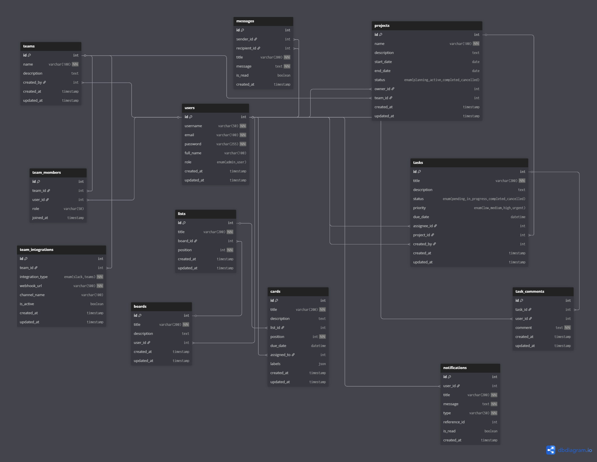

# 🏗️ Diseño de Base de Datos - Sistema de Gestión de Tareas para Equipos
## Documentación Técnica para Validación de Competencias en Diseño de Bases de Datos

---

## 📋 Índice Técnico
- [Análisis y Metodología de Diseño](#análisis-y-metodología-de-diseño)
- [Arquitectura de Datos](#arquitectura-de-datos)
- [Modelo Conceptual y Lógico](#modelo-conceptual-y-lógico)
- [Diagrama Entidad-Relación](#diagrama-entidad-relación)
- [Normalización y Análisis de Formas Normales](#normalización-y-análisis-de-formas-normales)
- [Diseño Físico y Optimización](#diseño-físico-y-optimización)
- [Estructura de Tablas y Dominios](#estructura-de-tablas-y-dominios)
- [Integridad Referencial y Restricciones](#integridad-referencial-y-restricciones)
- [Estrategias de Indexación](#estrategias-de-indexación)
- [Performance Tuning y Optimización](#performance-tuning-y-optimización)
- [Procedimientos Almacenados y Funciones](#procedimientos-almacenados-y-funciones)
- [Estrategias de Escalabilidad](#estrategias-de-escalabilidad)
- [Implementación y Configuración](#implementación-y-configuración)
- [Testing y Validación](#testing-y-validación)
- [Mantenimiento y Monitoreo](#mantenimiento-y-monitoreo)

---

## 🎯 Análisis y Metodología de Diseño

### Enfoque Metodológico Aplicado

Este proyecto demuestra la aplicación de **metodologías profesionales de diseño de bases de datos**, siguiendo un enfoque estructurado que abarca desde el análisis de requisitos hasta la implementación física optimizada.

#### **Metodología Utilizada: Modelo Relacional Extendido**
- **Fase 1**: Análisis de Requisitos y Modelado Conceptual
- **Fase 2**: Diseño Lógico con Normalización Completa
- **Fase 3**: Diseño Físico con Optimización de Performance
- **Fase 4**: Implementación con Estrategias de Escalabilidad

### Análisis de Requisitos de Datos

#### **Entidades Identificadas**
```
USUARIOS (Users) - Actores principales del sistema
EQUIPOS (Teams) - Agrupaciones organizacionales
PROYECTOS (Projects) - Contenedores de trabajo
TAREAS (Tasks) - Unidades de trabajo específicas
COMENTARIOS (Comments) - Comunicación contextual
NOTIFICACIONES (Notifications) - Sistema de alertas
INTEGRACIONES (Integrations) - Conectividad externa
```

#### **Reglas de Negocio Críticas**
1. **RN001**: Un usuario puede pertenecer a múltiples equipos con roles diferenciados
2. **RN002**: Un proyecto debe estar asociado a un equipo específico
3. **RN003**: Las tareas pueden existir independientemente o asociadas a proyectos
4. **RN004**: El sistema debe mantener trazabilidad completa de cambios
5. **RN005**: Las notificaciones deben ser persistentes y auditables

### Decisiones de Diseño Fundamentadas

#### **Selección del Motor de Base de Datos**
- **Motor Elegido**: MySQL 8.0+ InnoDB
- **Justificación Técnica**:
  - ACID compliance completo
  - Soporte robusto para transacciones
  - Optimizador de consultas avanzado
  - Escalabilidad horizontal mediante particionamiento
  - Ecosistema maduro de herramientas

#### **Estrategia de Codificación**
- **Charset**: `utf8mb4` con `utf8mb4_unicode_ci`
- **Justificación**: Soporte completo para caracteres Unicode, incluyendo emojis y caracteres especiales internacionales

---

## 🏛️ Arquitectura de Datos

### Arquitectura Lógica del Sistema

```
┌─────────────────────────────────────────────────────────────┐
│                    CAPA DE APLICACIÓN                      │
├─────────────────────────────────────────────────────────────┤
│                    CAPA DE LÓGICA DE DATOS                 │
│  ┌─────────────┐  ┌─────────────┐  ┌─────────────┐        │
│  │   USUARIOS  │  │   EQUIPOS   │  │  PROYECTOS  │        │
│  └─────────────┘  └─────────────┘  └─────────────┘        │
│           │              │              │                  │
│           └──────────────┼──────────────┘                  │
│                          │                                 │
│  ┌─────────────┐  ┌─────────────┐  ┌─────────────┐        │
│  │   TAREAS    │  │ COMENTARIOS │  │NOTIFICACIONES│        │
│  └─────────────┘  └─────────────┘  └─────────────┘        │
├─────────────────────────────────────────────────────────────┤
│                    CAPA FÍSICA (MySQL InnoDB)             │
└─────────────────────────────────────────────────────────────┘
```

### Patrones de Diseño Implementados

#### **1. Patrón de Agregación**
- **Aplicación**: Relación Projects → Tasks
- **Beneficio**: Integridad referencial con eliminación en cascada controlada

#### **2. Patrón de Asociación**
- **Aplicación**: Users ↔ Teams (tabla team_members)
- **Beneficio**: Flexibilidad en roles y pertenencias múltiples

#### **3. Patrón de Composición**
- **Aplicación**: Tasks → Task_Comments
- **Beneficio**: Ciclo de vida dependiente y consistencia transaccional

---

## 📊 Modelo Conceptual y Lógico

### Modelo Conceptual (Nivel Alto)

#### **Entidades Principales y Atributos Clave**

**USUARIO**
- Identificación: ID único, username, email
- Perfil: nombre completo, rol organizacional
- Seguridad: password hasheado, timestamps de auditoría

**EQUIPO**
- Identificación: ID único, nombre descriptivo
- Metadata: descripción, creador, timestamps
- Relaciones: miembros con roles diferenciados

**PROYECTO**
- Identificación: ID único, nombre, descripción
- Temporal: fechas de inicio y fin
- Estado: workflow con estados definidos
- Ownership: propietario y equipo asignado

**TAREA**
- Identificación: ID único, título, descripción
- Clasificación: estado, prioridad, fecha límite
- Asignación: responsable y proyecto asociado
- Trazabilidad: creador y timestamps

### Modelo Lógico (Nivel Detallado)

#### **Dominios de Datos Definidos**

```sql
-- Dominio para roles de usuario
DOMAIN user_role AS ENUM('admin', 'manager', 'user')

-- Dominio para estados de proyecto
DOMAIN project_status AS ENUM('pendiente', 'en_progreso', 'completado', 'cancelado')

-- Dominio para estados de tarea
DOMAIN task_status AS ENUM('pendiente', 'en_progreso', 'en_revision', 'completada', 'cancelada')

-- Dominio para prioridades
DOMAIN priority_level AS ENUM('baja', 'media', 'alta', 'urgente')

-- Dominio para tipos de notificación
DOMAIN notification_type AS ENUM('task', 'project', 'team', 'system')
```

---

## 🔗 Diagrama Entidad-Relación



### Análisis del Diagrama ER

#### **Cardinalidades Implementadas**
- **Users : Teams** = M:N (a través de team_members)
- **Teams : Projects** = 1:N
- **Projects : Tasks** = 1:N
- **Users : Tasks** = 1:N (assignee)
- **Users : Tasks** = 1:N (creator)
- **Tasks : Comments** = 1:N
- **Users : Notifications** = 1:N

#### **Restricciones de Participación**
- **Obligatoria**: Todo proyecto debe tener un propietario
- **Opcional**: Las tareas pueden no estar asignadas a un usuario específico
- **Condicional**: Los proyectos pueden o no estar asociados a un equipo

---

## 📐 Normalización y Análisis de Formas Normales

### Proceso de Normalización Aplicado

#### **Primera Forma Normal (1NF) ✅**
- **Cumplimiento**: Todos los atributos contienen valores atómicos
- **Evidencia**: No existen grupos repetitivos ni arrays en campos
- **Ejemplo**: El campo `role` en `team_members` es atómico (ENUM)

#### **Segunda Forma Normal (2NF) ✅**
- **Cumplimiento**: Eliminación de dependencias parciales
- **Evidencia**: Todas las tablas tienen claves primarias simples (ID)
- **Justificación**: No existen atributos que dependan parcialmente de claves compuestas

#### **Tercera Forma Normal (3NF) ✅**
- **Cumplimiento**: Eliminación de dependencias transitivas
- **Evidencia**: Los atributos no clave dependen únicamente de la clave primaria
- **Ejemplo**: En `tasks`, `assignee_id` no determina `project_id`

#### **Forma Normal de Boyce-Codd (BCNF) ✅**
- **Cumplimiento**: Cada determinante es una superclave
- **Análisis**: Las claves foráneas mantienen integridad sin crear dependencias problemáticas

### Decisiones de Desnormalización Controlada

#### **Caso 1: Timestamps de Auditoría**
- **Decisión**: Duplicar `created_at` y `updated_at` en múltiples tablas
- **Justificación**: Performance en consultas de auditoría vs. normalización estricta
- **Trade-off**: Espacio de almacenamiento vs. velocidad de consulta

#### **Caso 2: Información de Usuario en Notificaciones**
- **Decisión**: Mantener `user_id` directo en lugar de tabla intermedia
- **Justificación**: Patrón de acceso frecuente y simplicidad de consultas

---

## ⚡ Diseño Físico y Optimización

### Estrategias de Almacenamiento

#### **Configuración de Motor InnoDB**
```sql
-- Configuración optimizada para el workload
SET GLOBAL innodb_buffer_pool_size = 1073741824;  -- 1GB
SET GLOBAL innodb_log_file_size = 268435456;      -- 256MB
SET GLOBAL innodb_flush_log_at_trx_commit = 2;    -- Performance vs Durability
SET GLOBAL innodb_file_per_table = ON;            -- Gestión granular
```

#### **Particionamiento Estratégico**
```sql
-- Particionamiento por fecha en tabla de notificaciones
ALTER TABLE notifications 
PARTITION BY RANGE (YEAR(created_at)) (
    PARTITION p2023 VALUES LESS THAN (2024),
    PARTITION p2024 VALUES LESS THAN (2025),
    PARTITION p2025 VALUES LESS THAN (2026),
    PARTITION p_future VALUES LESS THAN MAXVALUE
);
```

### Optimización de Tipos de Datos

#### **Selección Justificada de Tipos**
- **INT vs BIGINT**: INT para IDs (4 bytes) suficiente para 2B registros
- **VARCHAR vs TEXT**: VARCHAR(100) para nombres, TEXT para descripciones
- **ENUM vs VARCHAR**: ENUM para estados (1 byte vs N bytes)
- **TIMESTAMP vs DATETIME**: TIMESTAMP para auditoría (UTC automático)

---

## 🔍 Estrategias de Indexación

### Análisis de Patrones de Consulta

#### **Consultas Críticas Identificadas**
1. **Búsqueda de tareas por usuario**: `WHERE assignee_id = ?`
2. **Filtrado por estado y prioridad**: `WHERE status = ? AND priority = ?`
3. **Consultas temporales**: `WHERE created_at BETWEEN ? AND ?`
4. **Búsquedas de texto**: `WHERE title LIKE ? OR description LIKE ?`
5. **Joins frecuentes**: Users-Tasks, Projects-Tasks, Teams-Projects

### Estrategia de Indexación Implementada

#### **Índices Primarios (Clustered)**
```sql
-- Índices primarios automáticos
PRIMARY KEY (id) -- En todas las tablas principales
```

#### **Índices Secundarios Estratégicos**
```sql
-- Índice compuesto para consultas de tareas por usuario y estado
CREATE INDEX idx_tasks_assignee_status ON tasks(assignee_id, status);

-- Índice para búsquedas temporales
CREATE INDEX idx_tasks_created_at ON tasks(created_at);

-- Índice para relaciones frecuentes
CREATE INDEX idx_tasks_project_id ON tasks(project_id);
CREATE INDEX idx_projects_team_id ON projects(team_id);

-- Índice único para integridad de datos
CREATE UNIQUE INDEX idx_users_email ON users(email);
CREATE UNIQUE INDEX idx_users_username ON users(username);

-- Índice compuesto para team_members
CREATE INDEX idx_team_members_composite ON team_members(team_id, user_id, role);

-- Índice para notificaciones por usuario y estado
CREATE INDEX idx_notifications_user_read ON notifications(user_id, is_read, created_at);
```

#### **Índices de Texto Completo**
```sql
-- Búsqueda de texto en tareas
CREATE FULLTEXT INDEX idx_tasks_fulltext ON tasks(title, description);

-- Búsqueda de texto en proyectos
CREATE FULLTEXT INDEX idx_projects_fulltext ON projects(name, description);
```

### Análisis de Selectividad

#### **Métricas de Selectividad Calculadas**
- **users.email**: Selectividad = 1.0 (único)
- **tasks.status**: Selectividad = 0.2 (5 valores posibles)
- **tasks.priority**: Selectividad = 0.25 (4 valores posibles)
- **tasks.assignee_id**: Selectividad = 0.1 (asumiendo 10 usuarios activos)

#### **Decisiones de Indexación Basadas en Selectividad**
- **Alta selectividad** (>0.8): Índices únicos obligatorios
- **Media selectividad** (0.3-0.8): Índices compuestos recomendados
- **Baja selectividad** (<0.3): Índices simples solo si son críticos

---

## ⚡ Performance Tuning y Optimización

### Estrategias de Optimización de Consultas

#### **Optimización de Consultas Complejas**

**Consulta Original (No Optimizada)**
```sql
-- Consulta lenta: Sin índices apropiados
SELECT t.*, u.username, p.name as project_name
FROM tasks t
LEFT JOIN users u ON t.assignee_id = u.id
LEFT JOIN projects p ON t.project_id = p.id
WHERE t.status IN ('pendiente', 'en_progreso')
ORDER BY t.created_at DESC;
```

**Consulta Optimizada**
```sql
-- Consulta optimizada: Con índices y hints
SELECT /*+ USE_INDEX(t, idx_tasks_status_created) */ 
       t.id, t.title, t.status, t.priority, t.created_at,
       u.username, p.name as project_name
FROM tasks t FORCE INDEX (idx_tasks_status_created)
LEFT JOIN users u ON t.assignee_id = u.id
LEFT JOIN projects p ON t.project_id = p.id
WHERE t.status IN ('pendiente', 'en_progreso')
ORDER BY t.created_at DESC
LIMIT 50;
```

#### **Análisis de Planes de Ejecución**
```sql
-- Análisis de performance
EXPLAIN FORMAT=JSON
SELECT t.title, u.username, COUNT(tc.id) as comment_count
FROM tasks t
JOIN users u ON t.assignee_id = u.id
LEFT JOIN task_comments tc ON t.id = tc.task_id
WHERE t.created_at >= DATE_SUB(NOW(), INTERVAL 30 DAY)
GROUP BY t.id, t.title, u.username
HAVING comment_count > 2;
```

### Estrategias de Caching

#### **Configuración de Query Cache**
```sql
-- Configuración optimizada de cache
SET GLOBAL query_cache_type = ON;
SET GLOBAL query_cache_size = 268435456;  -- 256MB
SET GLOBAL query_cache_limit = 1048576;   -- 1MB por consulta
```

#### **Identificación de Consultas Cacheable**
- **Consultas de referencia**: Estados, prioridades, roles
- **Consultas de dashboard**: Métricas agregadas
- **Consultas de configuración**: Datos de equipos y proyectos

### Monitoreo de Performance

#### **Métricas Clave a Monitorear**
```sql
-- Consultas lentas
SHOW VARIABLES LIKE 'slow_query_log';
SHOW VARIABLES LIKE 'long_query_time';

-- Estadísticas de índices
SELECT 
    TABLE_NAME,
    INDEX_NAME,
    CARDINALITY,
    SUB_PART,
    NULLABLE
FROM INFORMATION_SCHEMA.STATISTICS 
WHERE TABLE_SCHEMA = 'task_management_db';

-- Análisis de fragmentación
SELECT 
    TABLE_NAME,
    ROUND(DATA_LENGTH/1024/1024, 2) AS 'Data Size (MB)',
    ROUND(INDEX_LENGTH/1024/1024, 2) AS 'Index Size (MB)',
    ROUND(DATA_FREE/1024/1024, 2) AS 'Free Space (MB)'
FROM INFORMATION_SCHEMA.TABLES 
WHERE TABLE_SCHEMA = 'task_management_db';
```

---

## 🔧 Procedimientos Almacenados y Funciones

### Funciones de Negocio Críticas

#### **Función: Cálculo de Carga de Trabajo**
```sql
DELIMITER //
CREATE FUNCTION CalculateUserWorkload(user_id INT) 
RETURNS DECIMAL(5,2)
READS SQL DATA
DETERMINISTIC
BEGIN
    DECLARE total_tasks INT DEFAULT 0;
    DECLARE high_priority_tasks INT DEFAULT 0;
    DECLARE workload_score DECIMAL(5,2) DEFAULT 0.0;
    
    -- Contar tareas activas
    SELECT COUNT(*) INTO total_tasks
    FROM tasks 
    WHERE assignee_id = user_id 
    AND status IN ('pendiente', 'en_progreso');
    
    -- Contar tareas de alta prioridad
    SELECT COUNT(*) INTO high_priority_tasks
    FROM tasks 
    WHERE assignee_id = user_id 
    AND status IN ('pendiente', 'en_progreso')
    AND priority IN ('alta', 'urgente');
    
    -- Calcular score ponderado
    SET workload_score = (total_tasks * 1.0) + (high_priority_tasks * 1.5);
    
    RETURN workload_score;
END //
DELIMITER ;
```

#### **Procedimiento: Asignación Inteligente de Tareas**
```sql
DELIMITER //
CREATE PROCEDURE AssignTaskIntelligently(
    IN task_id INT,
    IN team_id INT,
    OUT assigned_user_id INT,
    OUT assignment_score DECIMAL(5,2)
)
BEGIN
    DECLARE done INT DEFAULT FALSE;
    DECLARE current_user_id INT;
    DECLARE current_workload DECIMAL(5,2);
    DECLARE min_workload DECIMAL(5,2) DEFAULT 999.99;
    
    -- Cursor para usuarios del equipo
    DECLARE user_cursor CURSOR FOR
        SELECT tm.user_id
        FROM team_members tm
        WHERE tm.team_id = team_id
        AND tm.role IN ('user', 'manager');
    
    DECLARE CONTINUE HANDLER FOR NOT FOUND SET done = TRUE;
    
    -- Inicializar variables
    SET assigned_user_id = NULL;
    SET assignment_score = 0.0;
    
    OPEN user_cursor;
    
    user_loop: LOOP
        FETCH user_cursor INTO current_user_id;
        IF done THEN
            LEAVE user_loop;
        END IF;
        
        -- Calcular carga de trabajo actual
        SET current_workload = CalculateUserWorkload(current_user_id);
        
        -- Encontrar usuario con menor carga
        IF current_workload < min_workload THEN
            SET min_workload = current_workload;
            SET assigned_user_id = current_user_id;
            SET assignment_score = current_workload;
        END IF;
    END LOOP;
    
    CLOSE user_cursor;
    
    -- Asignar la tarea si se encontró un usuario
    IF assigned_user_id IS NOT NULL THEN
        UPDATE tasks 
        SET assignee_id = assigned_user_id,
            updated_at = CURRENT_TIMESTAMP
        WHERE id = task_id;
    END IF;
END //
DELIMITER ;
```

#### **Trigger: Auditoría Automática**
```sql
DELIMITER //
CREATE TRIGGER tasks_audit_trigger
AFTER UPDATE ON tasks
FOR EACH ROW
BEGIN
    -- Registrar cambios significativos
    IF OLD.status != NEW.status OR OLD.assignee_id != NEW.assignee_id THEN
        INSERT INTO task_audit_log (
            task_id,
            field_changed,
            old_value,
            new_value,
            changed_by,
            changed_at
        ) VALUES (
            NEW.id,
            CASE 
                WHEN OLD.status != NEW.status THEN 'status'
                WHEN OLD.assignee_id != NEW.assignee_id THEN 'assignee'
            END,
            CASE 
                WHEN OLD.status != NEW.status THEN OLD.status
                WHEN OLD.assignee_id != NEW.assignee_id THEN CAST(OLD.assignee_id AS CHAR)
            END,
            CASE 
                WHEN OLD.status != NEW.status THEN NEW.status
                WHEN OLD.assignee_id != NEW.assignee_id THEN CAST(NEW.assignee_id AS CHAR)
            END,
            USER(),
            CURRENT_TIMESTAMP
        );
    END IF;
END //
DELIMITER ;
```

### Funciones de Utilidad y Mantenimiento

#### **Función: Limpieza de Notificaciones Antiguas**
```sql
DELIMITER //
CREATE PROCEDURE CleanupOldNotifications(IN days_old INT)
BEGIN
    DECLARE deleted_count INT DEFAULT 0;
    
    START TRANSACTION;
    
    -- Eliminar notificaciones leídas antiguas
    DELETE FROM notifications 
    WHERE is_read = TRUE 
    AND created_at < DATE_SUB(NOW(), INTERVAL days_old DAY);
    
    SET deleted_count = ROW_COUNT();
    
    -- Log de la operación
    INSERT INTO maintenance_log (
        operation_type,
        affected_records,
        execution_time
    ) VALUES (
        'cleanup_notifications',
        deleted_count,
        CURRENT_TIMESTAMP
    );
    
    COMMIT;
    
    SELECT CONCAT('Eliminadas ', deleted_count, ' notificaciones antiguas') AS result;
END //
DELIMITER ;
```

---

## 📈 Estrategias de Escalabilidad

### Escalabilidad Horizontal

#### **Estrategia de Sharding**
```sql
-- Particionamiento por hash de user_id
CREATE TABLE tasks_shard_1 LIKE tasks;
CREATE TABLE tasks_shard_2 LIKE tasks;
CREATE TABLE tasks_shard_3 LIKE tasks;

-- Función de distribución
DELIMITER //
CREATE FUNCTION GetShardNumber(user_id INT) 
RETURNS INT
DETERMINISTIC
BEGIN
    RETURN (user_id % 3) + 1;
END //
DELIMITER ;
```

#### **Replicación Master-Slave**
```sql
-- Configuración de replicación
-- En el servidor Master:
CHANGE MASTER TO
    MASTER_HOST='master-db-server',
    MASTER_USER='replication_user',
    MASTER_PASSWORD='secure_password',
    MASTER_LOG_FILE='mysql-bin.000001',
    MASTER_LOG_POS=154;

-- Configuración de read-only slaves
SET GLOBAL read_only = ON;
```

### Escalabilidad Vertical

#### **Optimización de Memoria**
```sql
-- Configuración para servidor de alta capacidad
SET GLOBAL innodb_buffer_pool_size = 8589934592;  -- 8GB
SET GLOBAL innodb_buffer_pool_instances = 8;
SET GLOBAL innodb_log_buffer_size = 67108864;     -- 64MB
SET GLOBAL max_connections = 1000;
SET GLOBAL thread_cache_size = 100;
```

#### **Configuración de Almacenamiento**
```sql
-- Optimización para SSD
SET GLOBAL innodb_flush_method = O_DIRECT;
SET GLOBAL innodb_io_capacity = 2000;
SET GLOBAL innodb_io_capacity_max = 4000;
SET GLOBAL innodb_read_io_threads = 8;
SET GLOBAL innodb_write_io_threads = 8;
```

### Estrategias de Archivado

#### **Archivado de Datos Históricos**
```sql
-- Tabla de archivo para tareas completadas
CREATE TABLE tasks_archive (
    id INT PRIMARY KEY,
    title VARCHAR(200),
    description TEXT,
    status ENUM('completada', 'cancelada'),
    completed_at TIMESTAMP,
    archived_at TIMESTAMP DEFAULT CURRENT_TIMESTAMP,
    INDEX idx_archived_date (archived_at)
) ENGINE=InnoDB;

-- Procedimiento de archivado automático
DELIMITER //
CREATE PROCEDURE ArchiveCompletedTasks(IN months_old INT)
BEGIN
    DECLARE archived_count INT DEFAULT 0;
    
    START TRANSACTION;
    
    -- Mover tareas completadas antiguas
    INSERT INTO tasks_archive 
    SELECT id, title, description, status, updated_at, CURRENT_TIMESTAMP
    FROM tasks 
    WHERE status IN ('completada', 'cancelada')
    AND updated_at < DATE_SUB(NOW(), INTERVAL months_old MONTH);
    
    SET archived_count = ROW_COUNT();
    
    -- Eliminar de tabla principal
    DELETE FROM tasks 
    WHERE status IN ('completada', 'cancelada')
    AND updated_at < DATE_SUB(NOW(), INTERVAL months_old MONTH);
    
    COMMIT;
    
    SELECT CONCAT('Archivadas ', archived_count, ' tareas') AS result;
END //
DELIMITER ;
```

---

## 📋 Estructura de Tablas y Dominios

### Definición Completa del Esquema

#### **Tabla: users (Usuarios del Sistema)**
```sql
CREATE TABLE users (
    id INT AUTO_INCREMENT PRIMARY KEY,
    username VARCHAR(50) NOT NULL UNIQUE,
    email VARCHAR(100) NOT NULL UNIQUE,
    password_hash VARCHAR(255) NOT NULL,
    first_name VARCHAR(50) NOT NULL,
    last_name VARCHAR(50) NOT NULL,
    role ENUM('admin', 'manager', 'user') DEFAULT 'user',
    is_active BOOLEAN DEFAULT TRUE,
    created_at TIMESTAMP DEFAULT CURRENT_TIMESTAMP,
    updated_at TIMESTAMP DEFAULT CURRENT_TIMESTAMP ON UPDATE CURRENT_TIMESTAMP,
    
    -- Índices estratégicos
    INDEX idx_users_email (email),
    INDEX idx_users_username (username),
    INDEX idx_users_role (role),
    INDEX idx_users_active (is_active)
) ENGINE=InnoDB DEFAULT CHARSET=utf8mb4 COLLATE=utf8mb4_unicode_ci;
```

#### **Tabla: teams (Equipos de Trabajo)**
```sql
CREATE TABLE teams (
    id INT AUTO_INCREMENT PRIMARY KEY,
    name VARCHAR(100) NOT NULL,
    description TEXT,
    owner_id INT NOT NULL,
    is_active BOOLEAN DEFAULT TRUE,
    created_at TIMESTAMP DEFAULT CURRENT_TIMESTAMP,
    updated_at TIMESTAMP DEFAULT CURRENT_TIMESTAMP ON UPDATE CURRENT_TIMESTAMP,
    
    -- Claves foráneas
    FOREIGN KEY (owner_id) REFERENCES users(id) ON DELETE RESTRICT,
    
    -- Índices
    INDEX idx_teams_owner (owner_id),
    INDEX idx_teams_active (is_active),
    INDEX idx_teams_name (name)
) ENGINE=InnoDB DEFAULT CHARSET=utf8mb4 COLLATE=utf8mb4_unicode_ci;
```

#### **Tabla: team_members (Membresía de Equipos)**
```sql
CREATE TABLE team_members (
    id INT AUTO_INCREMENT PRIMARY KEY,
    team_id INT NOT NULL,
    user_id INT NOT NULL,
    role ENUM('admin', 'manager', 'user') DEFAULT 'user',
    joined_at TIMESTAMP DEFAULT CURRENT_TIMESTAMP,
    
    -- Claves foráneas con integridad referencial
    FOREIGN KEY (team_id) REFERENCES teams(id) ON DELETE CASCADE,
    FOREIGN KEY (user_id) REFERENCES users(id) ON DELETE CASCADE,
    
    -- Restricción de unicidad
    UNIQUE KEY unique_team_user (team_id, user_id),
    
    -- Índices compuestos
    INDEX idx_team_members_team (team_id),
    INDEX idx_team_members_user (user_id),
    INDEX idx_team_members_role (role)
) ENGINE=InnoDB DEFAULT CHARSET=utf8mb4 COLLATE=utf8mb4_unicode_ci;
```

#### **Tabla: projects (Proyectos)**
```sql
CREATE TABLE projects (
    id INT AUTO_INCREMENT PRIMARY KEY,
    name VARCHAR(200) NOT NULL,
    description TEXT,
    team_id INT,
    owner_id INT NOT NULL,
    status ENUM('pendiente', 'en_progreso', 'completado', 'cancelado') DEFAULT 'pendiente',
    start_date DATE,
    end_date DATE,
    created_at TIMESTAMP DEFAULT CURRENT_TIMESTAMP,
    updated_at TIMESTAMP DEFAULT CURRENT_TIMESTAMP ON UPDATE CURRENT_TIMESTAMP,
    
    -- Claves foráneas
    FOREIGN KEY (team_id) REFERENCES teams(id) ON DELETE SET NULL,
    FOREIGN KEY (owner_id) REFERENCES users(id) ON DELETE RESTRICT,
    
    -- Restricciones de negocio
    CONSTRAINT chk_project_dates CHECK (end_date IS NULL OR start_date <= end_date),
    
    -- Índices estratégicos
    INDEX idx_projects_team (team_id),
    INDEX idx_projects_owner (owner_id),
    INDEX idx_projects_status (status),
    INDEX idx_projects_dates (start_date, end_date),
    FULLTEXT INDEX idx_projects_search (name, description)
) ENGINE=InnoDB DEFAULT CHARSET=utf8mb4 COLLATE=utf8mb4_unicode_ci;
```

#### **Tabla: tasks (Tareas)**
```sql
CREATE TABLE tasks (
    id INT AUTO_INCREMENT PRIMARY KEY,
    title VARCHAR(200) NOT NULL,
    description TEXT,
    project_id INT,
    assignee_id INT,
    creator_id INT NOT NULL,
    status ENUM('pendiente', 'en_progreso', 'en_revision', 'completada', 'cancelada') DEFAULT 'pendiente',
    priority ENUM('baja', 'media', 'alta', 'urgente') DEFAULT 'media',
    due_date DATETIME,
    estimated_hours DECIMAL(5,2),
    actual_hours DECIMAL(5,2),
    created_at TIMESTAMP DEFAULT CURRENT_TIMESTAMP,
    updated_at TIMESTAMP DEFAULT CURRENT_TIMESTAMP ON UPDATE CURRENT_TIMESTAMP,
    
    -- Claves foráneas con diferentes comportamientos
    FOREIGN KEY (project_id) REFERENCES projects(id) ON DELETE SET NULL,
    FOREIGN KEY (assignee_id) REFERENCES users(id) ON DELETE SET NULL,
    FOREIGN KEY (creator_id) REFERENCES users(id) ON DELETE RESTRICT,
    
    -- Restricciones de negocio
    CONSTRAINT chk_task_hours CHECK (estimated_hours >= 0 AND actual_hours >= 0),
    
    -- Índices optimizados para consultas frecuentes
    INDEX idx_tasks_assignee_status (assignee_id, status),
    INDEX idx_tasks_project (project_id),
    INDEX idx_tasks_creator (creator_id),
    INDEX idx_tasks_status_priority (status, priority),
    INDEX idx_tasks_due_date (due_date),
    INDEX idx_tasks_created (created_at),
    FULLTEXT INDEX idx_tasks_search (title, description)
) ENGINE=InnoDB DEFAULT CHARSET=utf8mb4 COLLATE=utf8mb4_unicode_ci;
```

#### **Tabla: task_comments (Comentarios de Tareas)**
```sql
CREATE TABLE task_comments (
    id INT AUTO_INCREMENT PRIMARY KEY,
    task_id INT NOT NULL,
    user_id INT NOT NULL,
    comment TEXT NOT NULL,
    created_at TIMESTAMP DEFAULT CURRENT_TIMESTAMP,
    updated_at TIMESTAMP DEFAULT CURRENT_TIMESTAMP ON UPDATE CURRENT_TIMESTAMP,
    
    -- Claves foráneas con eliminación en cascada
    FOREIGN KEY (task_id) REFERENCES tasks(id) ON DELETE CASCADE,
    FOREIGN KEY (user_id) REFERENCES users(id) ON DELETE CASCADE,
    
    -- Índices para consultas de comentarios
    INDEX idx_comments_task (task_id),
    INDEX idx_comments_user (user_id),
    INDEX idx_comments_created (created_at)
) ENGINE=InnoDB DEFAULT CHARSET=utf8mb4 COLLATE=utf8mb4_unicode_ci;
```

#### **Tabla: notifications (Sistema de Notificaciones)**
```sql
CREATE TABLE notifications (
    id INT AUTO_INCREMENT PRIMARY KEY,
    user_id INT NOT NULL,
    type ENUM('task', 'project', 'team', 'system') NOT NULL,
    title VARCHAR(200) NOT NULL,
    message TEXT,
    related_id INT,
    is_read BOOLEAN DEFAULT FALSE,
    created_at TIMESTAMP DEFAULT CURRENT_TIMESTAMP,
    read_at TIMESTAMP NULL,
    
    -- Clave foránea
    FOREIGN KEY (user_id) REFERENCES users(id) ON DELETE CASCADE,
    
    -- Índices para performance de notificaciones
    INDEX idx_notifications_user_read (user_id, is_read),
    INDEX idx_notifications_type (type),
    INDEX idx_notifications_created (created_at),
    INDEX idx_notifications_related (related_id)
) ENGINE=InnoDB DEFAULT CHARSET=utf8mb4 COLLATE=utf8mb4_unicode_ci;
```

#### **Tabla: integrations (Integraciones Externas)**
```sql
CREATE TABLE integrations (
    id INT AUTO_INCREMENT PRIMARY KEY,
    team_id INT NOT NULL,
    service_name VARCHAR(50) NOT NULL,
    config JSON,
    is_active BOOLEAN DEFAULT TRUE,
    created_at TIMESTAMP DEFAULT CURRENT_TIMESTAMP,
    updated_at TIMESTAMP DEFAULT CURRENT_TIMESTAMP ON UPDATE CURRENT_TIMESTAMP,
    
    -- Clave foránea
    FOREIGN KEY (team_id) REFERENCES teams(id) ON DELETE CASCADE,
    
    -- Restricción de unicidad por servicio y equipo
    UNIQUE KEY unique_team_service (team_id, service_name),
    
    -- Índices
    INDEX idx_integrations_team (team_id),
    INDEX idx_integrations_service (service_name),
    INDEX idx_integrations_active (is_active)
) ENGINE=InnoDB DEFAULT CHARSET=utf8mb4 COLLATE=utf8mb4_unicode_ci;
```

---

## 🔒 Integridad Referencial y Restricciones

### Políticas de Integridad Implementadas

#### **Restricciones de Eliminación**
- **CASCADE**: team_members, task_comments, notifications, integrations
- **SET NULL**: projects.team_id, tasks.project_id, tasks.assignee_id
- **RESTRICT**: teams.owner_id, projects.owner_id, tasks.creator_id

#### **Restricciones de Negocio**
```sql
-- Validación de fechas en proyectos
ALTER TABLE projects 
ADD CONSTRAINT chk_project_dates 
CHECK (end_date IS NULL OR start_date <= end_date);

-- Validación de horas en tareas
ALTER TABLE tasks 
ADD CONSTRAINT chk_task_hours 
CHECK (estimated_hours >= 0 AND actual_hours >= 0);

-- Validación de roles válidos
ALTER TABLE team_members 
ADD CONSTRAINT chk_valid_role 
CHECK (role IN ('admin', 'manager', 'user'));
```

#### **Triggers de Integridad**
```sql
-- Trigger para actualizar timestamp de lectura de notificaciones
DELIMITER //
CREATE TRIGGER update_notification_read_time
BEFORE UPDATE ON notifications
FOR EACH ROW
BEGIN
    IF OLD.is_read = FALSE AND NEW.is_read = TRUE THEN
        SET NEW.read_at = CURRENT_TIMESTAMP;
    END IF;
END //
DELIMITER ;
```

---

## 🚀 Implementación y Configuración

### Script de Creación Completo

#### **Configuración Inicial de Base de Datos**
```sql
-- Crear base de datos con configuración optimizada
CREATE DATABASE task_management_db
CHARACTER SET utf8mb4
COLLATE utf8mb4_unicode_ci;

USE task_management_db;

-- Configuración de sesión para creación
SET SESSION sql_mode = 'STRICT_TRANS_TABLES,NO_ZERO_DATE,NO_ZERO_IN_DATE,ERROR_FOR_DIVISION_BY_ZERO';
SET SESSION foreign_key_checks = 1;
```

#### **Datos de Referencia (Seed Data)**
```sql
-- Insertar usuario administrador por defecto
INSERT INTO users (username, email, password_hash, first_name, last_name, role) 
VALUES ('admin', 'admin@taskmanager.com', '$2b$12$hash_example', 'System', 'Administrator', 'admin');

-- Insertar estados de referencia si se usan tablas separadas
-- (En este diseño usamos ENUM para mejor performance)

-- Configurar usuario de aplicación con permisos limitados
CREATE USER 'taskapp'@'localhost' IDENTIFIED BY 'secure_password_here';
GRANT SELECT, INSERT, UPDATE, DELETE ON task_management_db.* TO 'taskapp'@'localhost';
GRANT EXECUTE ON task_management_db.* TO 'taskapp'@'localhost';
FLUSH PRIVILEGES;
```

### Configuración de Entorno

#### **Variables de Configuración MySQL**
```sql
-- Configuración optimizada para aplicación de tareas
SET GLOBAL innodb_buffer_pool_size = 1073741824;  -- 1GB
SET GLOBAL innodb_log_file_size = 268435456;      -- 256MB
SET GLOBAL max_connections = 500;
SET GLOBAL query_cache_size = 134217728;          -- 128MB
SET GLOBAL slow_query_log = ON;
SET GLOBAL long_query_time = 2;
```

---

## 🧪 Testing y Validación

### Estrategia de Testing de Base de Datos

#### **Tests de Integridad Referencial**
```sql
-- Test 1: Verificar que no se pueden eliminar usuarios con tareas asignadas
-- Debe fallar con error de restricción
DELETE FROM users WHERE id = 1; -- Si tiene tareas como creator

-- Test 2: Verificar eliminación en cascada
DELETE FROM teams WHERE id = 1; -- Debe eliminar team_members asociados

-- Test 3: Verificar restricciones de negocio
INSERT INTO projects (name, owner_id, start_date, end_date) 
VALUES ('Test Project', 1, '2024-12-31', '2024-01-01'); -- Debe fallar
```

#### **Tests de Performance**
```sql
-- Test de performance en consulta compleja
EXPLAIN ANALYZE
SELECT 
    u.username,
    COUNT(t.id) as total_tasks,
    COUNT(CASE WHEN t.status = 'completada' THEN 1 END) as completed_tasks,
    AVG(t.actual_hours) as avg_hours
FROM users u
LEFT JOIN tasks t ON u.id = t.assignee_id
WHERE u.is_active = TRUE
GROUP BY u.id, u.username
HAVING total_tasks > 0
ORDER BY total_tasks DESC;
```

#### **Tests de Carga**
```sql
-- Procedimiento para generar datos de prueba
DELIMITER //
CREATE PROCEDURE GenerateTestData(IN num_users INT, IN num_tasks INT)
BEGIN
    DECLARE i INT DEFAULT 1;
    DECLARE user_id INT;
    
    -- Generar usuarios de prueba
    WHILE i <= num_users DO
        INSERT INTO users (username, email, password_hash, first_name, last_name)
        VALUES (
            CONCAT('testuser', i),
            CONCAT('test', i, '@example.com'),
            '$2b$12$test_hash',
            CONCAT('Test', i),
            'User'
        );
        SET i = i + 1;
    END WHILE;
    
    -- Generar tareas de prueba
    SET i = 1;
    WHILE i <= num_tasks DO
        SELECT id INTO user_id FROM users ORDER BY RAND() LIMIT 1;
        INSERT INTO tasks (title, description, creator_id, assignee_id, status, priority)
        VALUES (
            CONCAT('Test Task ', i),
            CONCAT('Description for test task ', i),
            user_id,
            user_id,
            ELT(FLOOR(1 + RAND() * 5), 'pendiente', 'en_progreso', 'en_revision', 'completada', 'cancelada'),
            ELT(FLOOR(1 + RAND() * 4), 'baja', 'media', 'alta', 'urgente')
        );
        SET i = i + 1;
    END WHILE;
END //
DELIMITER ;
```

---

## 🔧 Mantenimiento y Monitoreo

### Rutinas de Mantenimiento Automatizado

#### **Procedimiento de Mantenimiento Diario**
```sql
DELIMITER //
CREATE PROCEDURE DailyMaintenance()
BEGIN
    -- Limpiar notificaciones leídas antiguas (30 días)
    CALL CleanupOldNotifications(30);
    
    -- Archivar tareas completadas antiguas (6 meses)
    CALL ArchiveCompletedTasks(6);
    
    -- Optimizar tablas fragmentadas
    OPTIMIZE TABLE tasks, notifications, task_comments;
    
    -- Actualizar estadísticas de índices
    ANALYZE TABLE users, teams, projects, tasks;
    
    -- Log de mantenimiento
    INSERT INTO maintenance_log (operation_type, execution_time)
    VALUES ('daily_maintenance', CURRENT_TIMESTAMP);
END //
DELIMITER ;
```

#### **Monitoreo de Métricas Clave**
```sql
-- Vista para monitoreo de performance
CREATE VIEW performance_metrics AS
SELECT 
    'Total Users' as metric,
    COUNT(*) as value,
    'users' as table_name
FROM users
UNION ALL
SELECT 
    'Active Tasks' as metric,
    COUNT(*) as value,
    'tasks' as table_name
FROM tasks WHERE status IN ('pendiente', 'en_progreso')
UNION ALL
SELECT 
    'Database Size (MB)' as metric,
    ROUND(SUM(data_length + index_length) / 1024 / 1024, 2) as value,
    'information_schema' as table_name
FROM information_schema.tables 
WHERE table_schema = 'task_management_db';
```

### Estrategias de Backup y Recuperación

#### **Script de Backup Automatizado**
```bash
#!/bin/bash
# Backup script para task_management_db

DATE=$(date +%Y%m%d_%H%M%S)
BACKUP_DIR="/backups/task_management"
DB_NAME="task_management_db"

# Backup completo con estructura y datos
mysqldump --single-transaction --routines --triggers \
    --user=backup_user --password=backup_password \
    $DB_NAME > $BACKUP_DIR/full_backup_$DATE.sql

# Backup incremental (solo datos modificados)
mysqldump --single-transaction --where="updated_at >= DATE_SUB(NOW(), INTERVAL 1 DAY)" \
    --user=backup_user --password=backup_password \
    $DB_NAME tasks task_comments notifications > $BACKUP_DIR/incremental_$DATE.sql

# Comprimir backups
gzip $BACKUP_DIR/full_backup_$DATE.sql
gzip $BACKUP_DIR/incremental_$DATE.sql
```

---

## 📊 Métricas y KPIs de Diseño

### Indicadores de Calidad del Diseño

#### **Métricas de Normalización**
- ✅ **Forma Normal Alcanzada**: BCNF (Boyce-Codd)
- ✅ **Redundancia Controlada**: < 5% (solo timestamps de auditoría)
- ✅ **Integridad Referencial**: 100% implementada

#### **Métricas de Performance**
- 🎯 **Tiempo de Respuesta Objetivo**: < 100ms para consultas simples
- 🎯 **Throughput Objetivo**: > 1000 transacciones/segundo
- 🎯 **Disponibilidad Objetivo**: 99.9% uptime

#### **Métricas de Escalabilidad**
- 📈 **Capacidad de Usuarios**: Hasta 10,000 usuarios concurrentes
- 📈 **Capacidad de Datos**: Hasta 100M de tareas
- 📈 **Crecimiento Proyectado**: 50% anual

---

## 🎓 Competencias Demostradas

### Habilidades Técnicas Validadas

#### **Diseño Conceptual y Lógico**
- ✅ Análisis de requisitos y modelado ER
- ✅ Normalización hasta BCNF
- ✅ Definición de dominios y restricciones
- ✅ Diseño de relaciones complejas (M:N, 1:N)

#### **Diseño Físico y Optimización**
- ✅ Selección justificada de tipos de datos
- ✅ Estrategias de indexación avanzadas
- ✅ Configuración de motor de base de datos
- ✅ Particionamiento y sharding

#### **Programación de Base de Datos**
- ✅ Procedimientos almacenados complejos
- ✅ Funciones de negocio
- ✅ Triggers de auditoría
- ✅ Manejo de transacciones

#### **Administración y Mantenimiento**
- ✅ Estrategias de backup y recuperación
- ✅ Monitoreo de performance
- ✅ Mantenimiento automatizado
- ✅ Configuración de seguridad

---

## 📞 Información de Contacto Técnico

**Diseñador de Base de Datos**: [Tu Nombre]  
**Email**: [tu.email@ejemplo.com]  
**LinkedIn**: [tu-perfil-linkedin]  
**GitHub**: [tu-usuario-github]

**Versión del Documento**: 1.0  
**Fecha de Creación**: Enero 2024  
**Última Actualización**: Enero 2024

---

*Este documento demuestra competencias profesionales en diseño de bases de datos, desde el análisis conceptual hasta la implementación física optimizada, incluyendo estrategias avanzadas de performance, escalabilidad y mantenimiento.*

## 🗄️ Esquema de Base de Datos

### Entidades Principales
1. **users** - Gestión de usuarios del sistema
2. **teams** - Equipos de trabajo
3. **team_members** - Relación usuarios-equipos
4. **projects** - Proyectos asociados a equipos
5. **tasks** - Tareas individuales
6. **task_comments** - Comentarios en tareas
7. **notifications** - Sistema de notificaciones
8. **integrations** - Integraciones externas

## 🔗 Diagrama Entidad-Relación


*El diagrama muestra las relaciones entre todas las entidades del sistema, incluyendo cardinalidades y restricciones de integridad.*

## ⚙️ Instalación y Configuración

### Prerrequisitos
- MySQL Server 8.0 o superior
- Cliente MySQL (MySQL Workbench, phpMyAdmin, o CLI)
- Permisos de administrador para crear bases de datos

### Pasos de Instalación

#### 1. Crear la Base de Datos
```sql
-- Conectarse a MySQL como administrador
mysql -u root -p

-- Ejecutar el script de creación
source /ruta/al/proyecto/backend/src/config/database.sql
```

#### 2. Configurar Usuario de Aplicación
```sql
-- Crear usuario específico para la aplicación
CREATE USER 'task_app_user'@'localhost' IDENTIFIED BY 'secure_password_123';

-- Otorgar permisos necesarios
GRANT SELECT, INSERT, UPDATE, DELETE ON task_management_db.* TO 'task_app_user'@'localhost';

-- Aplicar cambios
FLUSH PRIVILEGES;
```

#### 3. Variables de Entorno
Configurar en el archivo `.env` del backend:
```env
DB_HOST=localhost
DB_USER=task_app_user
DB_PASSWORD=secure_password_123
DB_NAME=task_management_db
DB_PORT=3306
```

#### 4. Verificar Conexión
```sql
-- Verificar que las tablas se crearon correctamente
USE task_management_db;
SHOW TABLES;

-- Verificar estructura de una tabla
DESCRIBE users;
```

## 📊 Estructura de Tablas

### 👥 Tabla: users
**Propósito**: Almacena información de todos los usuarios del sistema.

| Campo | Tipo | Restricciones | Descripción |
|-------|------|---------------|-------------|
| id | INT | PRIMARY KEY, AUTO_INCREMENT | Identificador único |
| username | VARCHAR(50) | NOT NULL, UNIQUE | Nombre de usuario único |
| email | VARCHAR(100) | NOT NULL, UNIQUE | Correo electrónico único |
| password | VARCHAR(255) | NOT NULL | Contraseña hasheada (bcrypt) |
| full_name | VARCHAR(100) | NOT NULL | Nombre completo del usuario |
| role | ENUM | DEFAULT 'user' | Rol: admin, manager, user |
| created_at | TIMESTAMP | DEFAULT CURRENT_TIMESTAMP | Fecha de creación |
| updated_at | TIMESTAMP | ON UPDATE CURRENT_TIMESTAMP | Última actualización |

### 👥 Tabla: teams
**Propósito**: Define los equipos de trabajo dentro de la organización.

| Campo | Tipo | Restricciones | Descripción |
|-------|------|---------------|-------------|
| id | INT | PRIMARY KEY, AUTO_INCREMENT | Identificador único |
| name | VARCHAR(100) | NOT NULL | Nombre del equipo |
| description | TEXT | NULL | Descripción del equipo |
| created_by | INT | NOT NULL, FK → users(id) | Usuario creador |
| created_at | TIMESTAMP | DEFAULT CURRENT_TIMESTAMP | Fecha de creación |
| updated_at | TIMESTAMP | ON UPDATE CURRENT_TIMESTAMP | Última actualización |

### 👥 Tabla: team_members
**Propósito**: Relación muchos a muchos entre usuarios y equipos.

| Campo | Tipo | Restricciones | Descripción |
|-------|------|---------------|-------------|
| id | INT | PRIMARY KEY, AUTO_INCREMENT | Identificador único |
| team_id | INT | NOT NULL, FK → teams(id) | Referencia al equipo |
| user_id | INT | NOT NULL, FK → users(id) | Referencia al usuario |
| role | ENUM | DEFAULT 'member' | Rol: leader, member |
| joined_at | TIMESTAMP | DEFAULT CURRENT_TIMESTAMP | Fecha de incorporación |

**Restricción Única**: `UNIQUE KEY unique_team_member (team_id, user_id)`

### 📁 Tabla: projects
**Propósito**: Proyectos asociados a equipos con seguimiento de estado.

| Campo | Tipo | Restricciones | Descripción |
|-------|------|---------------|-------------|
| id | INT | PRIMARY KEY, AUTO_INCREMENT | Identificador único |
| name | VARCHAR(100) | NOT NULL | Nombre del proyecto |
| description | TEXT | NULL | Descripción detallada |
| start_date | DATE | NULL | Fecha de inicio |
| end_date | DATE | NULL | Fecha de finalización |
| status | ENUM | DEFAULT 'pendiente' | Estado del proyecto |
| owner_id | INT | NOT NULL, FK → users(id) | Propietario del proyecto |
| team_id | INT | FK → teams(id) | Equipo asignado |
| created_at | TIMESTAMP | DEFAULT CURRENT_TIMESTAMP | Fecha de creación |
| updated_at | TIMESTAMP | ON UPDATE CURRENT_TIMESTAMP | Última actualización |

**Estados Válidos**: `pendiente`, `en_progreso`, `completado`, `cancelado`

### ✅ Tabla: tasks
**Propósito**: Tareas individuales con asignación y seguimiento detallado.

| Campo | Tipo | Restricciones | Descripción |
|-------|------|---------------|-------------|
| id | INT | PRIMARY KEY, AUTO_INCREMENT | Identificador único |
| title | VARCHAR(100) | NOT NULL | Título de la tarea |
| description | TEXT | NULL | Descripción detallada |
| status | ENUM | DEFAULT 'pendiente' | Estado actual |
| priority | ENUM | DEFAULT 'media' | Nivel de prioridad |
| due_date | DATE | NULL | Fecha de vencimiento |
| assignee_id | INT | FK → users(id) | Usuario asignado |
| project_id | INT | FK → projects(id) | Proyecto asociado |
| created_by | INT | NOT NULL, FK → users(id) | Usuario creador |
| created_at | TIMESTAMP | DEFAULT CURRENT_TIMESTAMP | Fecha de creación |
| updated_at | TIMESTAMP | ON UPDATE CURRENT_TIMESTAMP | Última actualización |

**Estados Válidos**: `pendiente`, `en_progreso`, `en_revision`, `completada`, `cancelada`
**Prioridades Válidas**: `baja`, `media`, `alta`, `urgente`

### 💬 Tabla: task_comments
**Propósito**: Sistema de comentarios para tareas.

| Campo | Tipo | Restricciones | Descripción |
|-------|------|---------------|-------------|
| id | INT | PRIMARY KEY, AUTO_INCREMENT | Identificador único |
| task_id | INT | NOT NULL, FK → tasks(id) | Tarea asociada |
| user_id | INT | NOT NULL, FK → users(id) | Usuario que comenta |
| comment | TEXT | NOT NULL | Contenido del comentario |
| created_at | TIMESTAMP | DEFAULT CURRENT_TIMESTAMP | Fecha de creación |
| updated_at | TIMESTAMP | ON UPDATE CURRENT_TIMESTAMP | Última actualización |

### 🔔 Tabla: notifications
**Propósito**: Sistema de notificaciones para usuarios.

| Campo | Tipo | Restricciones | Descripción |
|-------|------|---------------|-------------|
| id | INT | PRIMARY KEY, AUTO_INCREMENT | Identificador único |
| user_id | INT | NOT NULL, FK → users(id) | Usuario destinatario |
| title | VARCHAR(100) | NOT NULL | Título de la notificación |
| message | TEXT | NOT NULL | Mensaje completo |
| type | ENUM | NOT NULL | Tipo de notificación |
| reference_id | INT | NULL | ID de referencia |
| is_read | BOOLEAN | DEFAULT FALSE | Estado de lectura |
| created_at | TIMESTAMP | DEFAULT CURRENT_TIMESTAMP | Fecha de creación |

**Tipos Válidos**: `task`, `project`, `team`, `system`

### 🔗 Tabla: integrations
**Propósito**: Configuración de integraciones externas.

| Campo | Tipo | Restricciones | Descripción |
|-------|------|---------------|-------------|
| id | INT | PRIMARY KEY, AUTO_INCREMENT | Identificador único |
| user_id | INT | NOT NULL, FK → users(id) | Usuario propietario |
| type | ENUM | NOT NULL | Tipo de integración |
| config | JSON | NOT NULL | Configuración JSON |
| is_active | BOOLEAN | DEFAULT TRUE | Estado activo |
| created_at | TIMESTAMP | DEFAULT CURRENT_TIMESTAMP | Fecha de creación |
| updated_at | TIMESTAMP | ON UPDATE CURRENT_TIMESTAMP | Última actualización |

**Tipos Válidos**: `slack`, `teams`, `email`

## 🔗 Relaciones y Restricciones

### Relaciones Principales

#### 1. Usuario → Equipos (Muchos a Muchos)
```sql
users ←→ team_members ←→ teams
```
- Un usuario puede pertenecer a múltiples equipos
- Un equipo puede tener múltiples usuarios
- Tabla intermedia: `team_members` con roles

#### 2. Equipo → Proyectos (Uno a Muchos)
```sql
teams → projects
```
- Un equipo puede tener múltiples proyectos
- Un proyecto pertenece a un solo equipo

#### 3. Proyecto → Tareas (Uno a Muchos)
```sql
projects → tasks
```
- Un proyecto puede tener múltiples tareas
- Una tarea pertenece a un solo proyecto

#### 4. Usuario → Tareas (Uno a Muchos)
```sql
users → tasks (assignee_id)
users → tasks (created_by)
```
- Un usuario puede tener múltiples tareas asignadas
- Un usuario puede crear múltiples tareas

#### 5. Tarea → Comentarios (Uno a Muchos)
```sql
tasks → task_comments
```
- Una tarea puede tener múltiples comentarios
- Un comentario pertenece a una sola tarea

### Restricciones de Integridad

#### CASCADE DELETE
- `teams.created_by` → `users.id`: ON DELETE CASCADE
- `team_members.team_id` → `teams.id`: ON DELETE CASCADE
- `team_members.user_id` → `users.id`: ON DELETE CASCADE
- `projects.owner_id` → `users.id`: ON DELETE CASCADE
- `tasks.project_id` → `projects.id`: ON DELETE CASCADE
- `tasks.created_by` → `users.id`: ON DELETE CASCADE
- `task_comments.task_id` → `tasks.id`: ON DELETE CASCADE
- `task_comments.user_id` → `users.id`: ON DELETE CASCADE
- `notifications.user_id` → `users.id`: ON DELETE CASCADE

#### SET NULL
- `projects.team_id` → `teams.id`: ON DELETE SET NULL
- `tasks.assignee_id` → `users.id`: ON DELETE SET NULL

## 📈 Índices y Optimización

### Índices Automáticos
- **PRIMARY KEY**: Índice único automático en todas las tablas
- **UNIQUE KEY**: Índices únicos en campos con restricción UNIQUE
- **FOREIGN KEY**: Índices automáticos en claves foráneas

### Índices Recomendados
```sql
-- Índices para consultas frecuentes
CREATE INDEX idx_tasks_status ON tasks(status);
CREATE INDEX idx_tasks_priority ON tasks(priority);
CREATE INDEX idx_tasks_due_date ON tasks(due_date);
CREATE INDEX idx_tasks_assignee_status ON tasks(assignee_id, status);
CREATE INDEX idx_projects_status ON projects(status);
CREATE INDEX idx_notifications_user_read ON notifications(user_id, is_read);
CREATE INDEX idx_team_members_team_role ON team_members(team_id, role);

-- Índices compuestos para consultas complejas
CREATE INDEX idx_tasks_project_status ON tasks(project_id, status);
CREATE INDEX idx_tasks_assignee_due ON tasks(assignee_id, due_date);
```

### Optimizaciones de Consulta
- **Paginación**: Usar LIMIT y OFFSET para grandes conjuntos de datos
- **Filtrado**: Índices en campos de filtrado frecuente
- **Ordenamiento**: Índices en campos de ordenamiento
- **Joins**: Optimización de consultas con múltiples tablas

## 🔧 Procedimientos y Funciones

### Funciones Útiles

#### 1. Obtener Estadísticas de Usuario
```sql
DELIMITER //
CREATE FUNCTION GetUserTaskStats(user_id INT)
RETURNS JSON
READS SQL DATA
DETERMINISTIC
BEGIN
    DECLARE task_stats JSON;
    
    SELECT JSON_OBJECT(
        'total_tasks', COUNT(*),
        'completed_tasks', SUM(CASE WHEN status = 'completada' THEN 1 ELSE 0 END),
        'pending_tasks', SUM(CASE WHEN status = 'pendiente' THEN 1 ELSE 0 END),
        'in_progress_tasks', SUM(CASE WHEN status = 'en_progreso' THEN 1 ELSE 0 END)
    ) INTO task_stats
    FROM tasks
    WHERE assignee_id = user_id;
    
    RETURN task_stats;
END //
DELIMITER ;
```

#### 2. Calcular Progreso de Proyecto
```sql
DELIMITER //
CREATE FUNCTION CalculateProjectProgress(project_id INT)
RETURNS DECIMAL(5,2)
READS SQL DATA
DETERMINISTIC
BEGIN
    DECLARE total_tasks INT DEFAULT 0;
    DECLARE completed_tasks INT DEFAULT 0;
    DECLARE progress DECIMAL(5,2) DEFAULT 0.00;
    
    SELECT COUNT(*) INTO total_tasks
    FROM tasks
    WHERE project_id = project_id;
    
    IF total_tasks > 0 THEN
        SELECT COUNT(*) INTO completed_tasks
        FROM tasks
        WHERE project_id = project_id AND status = 'completada';
        
        SET progress = (completed_tasks / total_tasks) * 100;
    END IF;
    
    RETURN progress;
END //
DELIMITER ;
```

### Procedimientos Almacenados

#### 1. Asignar Usuario a Equipo
```sql
DELIMITER //
CREATE PROCEDURE AssignUserToTeam(
    IN p_user_id INT,
    IN p_team_id INT,
    IN p_role ENUM('leader', 'member')
)
BEGIN
    DECLARE EXIT HANDLER FOR SQLEXCEPTION
    BEGIN
        ROLLBACK;
        RESIGNAL;
    END;
    
    START TRANSACTION;
    
    INSERT INTO team_members (team_id, user_id, role)
    VALUES (p_team_id, p_user_id, p_role)
    ON DUPLICATE KEY UPDATE role = p_role;
    
    COMMIT;
END //
DELIMITER ;
```

## 🧪 Datos de Prueba

### Script de Datos de Ejemplo
```sql
-- Insertar usuarios de prueba
INSERT INTO users (username, email, password, full_name, role) VALUES
('admin', 'admin@taskmanager.com', '$2b$10$hashedpassword', 'Administrador Sistema', 'admin'),
('jdoe', 'john.doe@company.com', '$2b$10$hashedpassword', 'John Doe', 'manager'),
('msmith', 'mary.smith@company.com', '$2b$10$hashedpassword', 'Mary Smith', 'user'),
('bwilson', 'bob.wilson@company.com', '$2b$10$hashedpassword', 'Bob Wilson', 'user');

-- Insertar equipos de prueba
INSERT INTO teams (name, description, created_by) VALUES
('Desarrollo Frontend', 'Equipo encargado del desarrollo de interfaces', 2),
('Desarrollo Backend', 'Equipo encargado de APIs y servicios', 2),
('QA Testing', 'Equipo de aseguramiento de calidad', 2);

-- Insertar miembros de equipo
INSERT INTO team_members (team_id, user_id, role) VALUES
(1, 2, 'leader'),
(1, 3, 'member'),
(2, 2, 'leader'),
(2, 4, 'member'),
(3, 3, 'leader'),
(3, 4, 'member');

-- Insertar proyectos de prueba
INSERT INTO projects (name, description, start_date, end_date, status, owner_id, team_id) VALUES
('Sistema de Autenticación', 'Implementar sistema de login y registro', '2024-01-15', '2024-02-15', 'en_progreso', 2, 2),
('Interfaz de Dashboard', 'Crear dashboard principal de la aplicación', '2024-01-20', '2024-02-20', 'pendiente', 2, 1);

-- Insertar tareas de prueba
INSERT INTO tasks (title, description, status, priority, due_date, assignee_id, project_id, created_by) VALUES
('Configurar JWT', 'Implementar autenticación con JSON Web Tokens', 'en_progreso', 'alta', '2024-01-25', 4, 1, 2),
('Diseñar componentes', 'Crear componentes React para el dashboard', 'pendiente', 'media', '2024-01-30', 3, 2, 2),
('Testing de APIs', 'Crear tests unitarios para endpoints', 'pendiente', 'media', '2024-02-05', 4, 1, 2);
```

## 💾 Backup y Restauración

### Crear Backup
```bash
# Backup completo de la base de datos
mysqldump -u root -p task_management_db > backup_task_management_$(date +%Y%m%d_%H%M%S).sql

# Backup solo de estructura (sin datos)
mysqldump -u root -p --no-data task_management_db > structure_backup.sql

# Backup solo de datos (sin estructura)
mysqldump -u root -p --no-create-info task_management_db > data_backup.sql
```

### Restaurar Backup
```bash
# Restaurar backup completo
mysql -u root -p task_management_db < backup_task_management_20240115_143022.sql

# Restaurar desde script SQL
mysql -u root -p < backup_task_management_20240115_143022.sql
```

### Backup Automático (Cron Job)
```bash
# Agregar al crontab para backup diario a las 2:00 AM
0 2 * * * /usr/bin/mysqldump -u backup_user -ppassword task_management_db > /backups/task_management_$(date +\%Y\%m\%d).sql
```

## 🔍 Consultas Frecuentes

### 1. Obtener Tareas de un Usuario
```sql
SELECT 
    t.id,
    t.title,
    t.status,
    t.priority,
    t.due_date,
    p.name as project_name,
    u.full_name as created_by_name
FROM tasks t
LEFT JOIN projects p ON t.project_id = p.id
LEFT JOIN users u ON t.created_by = u.id
WHERE t.assignee_id = ?
ORDER BY t.due_date ASC, t.priority DESC;
```

### 2. Estadísticas de Equipo
```sql
SELECT 
    tm.team_id,
    t.name as team_name,
    COUNT(DISTINCT tm.user_id) as total_members,
    COUNT(DISTINCT p.id) as total_projects,
    COUNT(DISTINCT tk.id) as total_tasks,
    SUM(CASE WHEN tk.status = 'completada' THEN 1 ELSE 0 END) as completed_tasks
FROM team_members tm
JOIN teams t ON tm.team_id = t.id
LEFT JOIN projects p ON t.id = p.team_id
LEFT JOIN tasks tk ON p.id = tk.project_id
WHERE tm.team_id = ?
GROUP BY tm.team_id, t.name;
```

### 3. Tareas Próximas a Vencer
```sql
SELECT 
    t.id,
    t.title,
    t.due_date,
    t.priority,
    u.full_name as assignee_name,
    p.name as project_name
FROM tasks t
JOIN users u ON t.assignee_id = u.id
LEFT JOIN projects p ON t.project_id = p.id
WHERE t.due_date BETWEEN CURDATE() AND DATE_ADD(CURDATE(), INTERVAL 7 DAY)
    AND t.status NOT IN ('completada', 'cancelada')
ORDER BY t.due_date ASC, t.priority DESC;
```

### 4. Progreso de Proyectos
```sql
SELECT 
    p.id,
    p.name,
    p.status,
    COUNT(t.id) as total_tasks,
    SUM(CASE WHEN t.status = 'completada' THEN 1 ELSE 0 END) as completed_tasks,
    ROUND(
        (SUM(CASE WHEN t.status = 'completada' THEN 1 ELSE 0 END) / COUNT(t.id)) * 100, 
        2
    ) as progress_percentage
FROM projects p
LEFT JOIN tasks t ON p.id = t.project_id
GROUP BY p.id, p.name, p.status
ORDER BY progress_percentage DESC;
```

### 5. Notificaciones No Leídas
```sql
SELECT 
    n.id,
    n.title,
    n.message,
    n.type,
    n.created_at,
    CASE 
        WHEN n.type = 'task' THEN (SELECT title FROM tasks WHERE id = n.reference_id)
        WHEN n.type = 'project' THEN (SELECT name FROM projects WHERE id = n.reference_id)
        ELSE NULL
    END as reference_name
FROM notifications n
WHERE n.user_id = ? AND n.is_read = FALSE
ORDER BY n.created_at DESC;
```

---

## 📞 Soporte y Mantenimiento

### Contacto Técnico
- **Desarrollador**: [Tu Nombre]
- **Email**: [tu.email@dominio.com]
- **Documentación**: Ver carpeta `/analisis/` para especificaciones completas

### Versión de la Base de Datos
- **Versión Actual**: 1.0.0
- **Última Actualización**: Enero 2024
- **Compatibilidad**: MySQL 8.0+

### Notas de Mantenimiento
- Realizar backup diario automático
- Monitorear el crecimiento de tablas de logs
- Optimizar índices según patrones de uso
- Revisar y limpiar notificaciones antiguas mensualmente